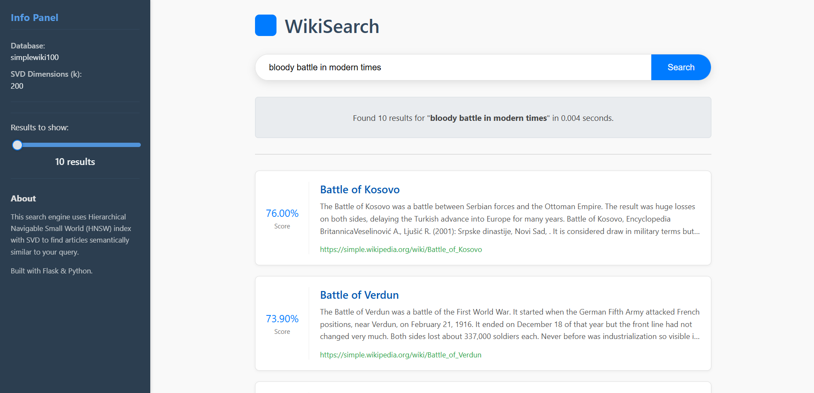

# WikiSearch Engine 🔍

## Dariusz Marecik

WikiSearch to projekt wyszukiwarki artykułów z Wikipedii skupiającej się na treściach związanych z historią. Celem tego projektu jest stworzenie efektywnego narzędzia do przeszukiwania i odnajdywania informacji historycznych, wykorzystującego techniki przetwarzania języka naturalnego oraz redukcji wymiarowości za pomocą SVD (Singular Value Decomposition) oraz indeksu HNSW (Hierarchical Navigable Small World).

### Struktura Projektu

Projekt składa się z kilku kluczowych modułów, które współpracują ze sobą, aby zapewnić funkcjonalność wyszukiwarki:

* **`dump_loader.py`**: Ten skrypt odpowiada za ładowanie danych z pliku XML (zrzutu Wikipedii), czyszczenie tekstu artykułów oraz zapisywanie ich do bazy danych SQLite.
    * **Czyszczenie tekstu**: Skrypt wykorzystuje bibliotekę `mwparserfromhell` do usuwania składni wiki, a także wyrażenia regularne do eliminacji niechcianych elementów, takich jak miniatury, nadmiarowe spacje czy formatowanie.
    * **Filtrowanie**: Artykuły są filtrowane pod kątem długości (minimum 100 słów) oraz typu (pomijane są przekierowania i artykuły spoza głównej przestrzeni nazw).
    * **Baza danych**: Dane są przechowywane w tabeli `articles` w bazie `simplewiki2.db` (lub `simplewiki100.db` w przypadku aplikacji Flask), zawierającej takie pola jak `url`, `title`, `intro` (pierwszy akapit) i `content`.

* **`scraper.py`**: Alternatywny moduł do pozyskiwania danych, który skanuje Wikipedię (konkretnie strony angielskiej Wikipedii związane z historią) za pomocą web scrapingu.
    * **Filtrowanie historyczne**: Scraper identyfikuje artykuły związane z historią na podstawie listy słów kluczowych (np. 'history', 'ancient', 'war', 'empire') w tytule.
    * **Inteligentne przeszukiwanie**: Wykorzystuje kolejkę (deque) do zarządzania adresami URL do odwiedzenia, przeszukując kategorie historyczne oraz artykuły z linków, unikając duplikatów i niechcianych stron.
    * **Kontrola szybkości**: Wbudowana jest losowa pauza między zapytaniami, aby uniknąć przeciążenia serwerów Wikipedii.
    * **Zapisywanie postępu**: Stan scrapowania (kolejka, odwiedzone adresy, liczba artykułów) jest regularnie zapisywany, co pozwala na wznowienie procesu w razie przerwania.

* **`database_manager.py`**: Klasa odpowiedzialna za zarządzanie połączeniem z bazą danych SQLite. Umożliwia pobieranie wszystkich treści artykułów oraz konkretnych danych (np. URL, tytuł, intro) na podstawie listy identyfikatorów.

* **`search_engine.py`**: Serce wyszukiwarki. Odpowiada za budowanie modelu TF-IDF (Term Frequency-Inverse Document Frequency) oraz opcjonalne zastosowanie SVD do redukcji wymiarowości i efektywnego wyszukiwania podobnych dokumentów.
    * **Modelowanie BOW (Bag of Words)**: Tekst artykułów jest przetwarzany na wektory reprezentujące częstotliwość występowania słów.
    * **TF-IDF**: Wagi słów są dostosowywane za pomocą miary IDF, która obniża znaczenie często występujących, a mniej istotnych słów.
    * **SVD (Singular Value Decomposition)**: Opcjonalnie, macierz TF-IDF może być poddana dekompozycji SVD, co pozwala na redukcję wymiarowości i lepsze uchwycenie ukrytych zależności semantycznych między słowami i dokumentami.
    * **HNSW (Hierarchical Navigable Small World)**: Po zastosowaniu SVD, wykorzystywany jest indeks HNSW do szybkiego wyszukiwania najbliższych sąsiadów (artykułów) w przestrzeni o zmniejszonej wymiarowości, co przyspiesza proces wyszukiwania.
    * **Zapisywanie/ładowanie modeli**: Macierz TF-IDF i modele SVD/HNSW mogą być zapisywane i ładowane z plików, co znacznie skraca czas uruchamiania silnika wyszukiwania.

* **`flask_app.py`**: Aplikacja webowa napisana we Flasku, która udostępnia interfejs użytkownika do wyszukiwania artykułów.
    * **Wyszukiwanie**: Przyjmuje zapytania od użytkownika i przekazuje je do `search_engine_manager` (prawdopodobnie wrapper dla `search_engine.py`), a następnie wyświetla posortowane wyniki z bazy danych.
    * **Konfiguracja**: Umożliwia ustawienie nazwy bazy danych, wartości `k` dla SVD oraz liczby wyników do wyświetlenia.
    * **Pomiar czasu**: Mierzy i wyświetla czas potrzebny na wykonanie zapytania.

* **`simplifier.py`**:  mduł odpowiedzialny za upraszczanie słów, np. lematyzację i stemming, przed ich przetworzeniem przez silnik wyszukiwania.

### Foldery w Repozytorium

* **`dump/`**: Ten folder przechowuje zrzuty (dump) Wikipedii w formacie XML, które są wykorzystywane przez skrypt `dump_loader.py` do początkowego zapełnienia bazy danych artykułami.
* **`saved_svd/`**: W tym katalogu przechowywane są zapisane modele SVD, takie jak macierze U, D, Vt oraz indeks HNSW. Dzięki temu nie ma potrzeby ponownego obliczania SVD przy każdym uruchomieniu aplikacji, co znacznie przyspiesza inicjalizację silnika wyszukiwania.
* **`saved_data/`**: Ten folder zawiera zapisane struktury danych związane z modelem Bag of Words (BOW), takie jak macierz `csc_BOW` (sparse matrix) oraz pliki `.pkl` zawierające słowniki `number_to_word`, `word_to_number` i macierz diagonalną `idf_diag`. Jest to kluczowe dla szybkiego wczytywania stanu silnika wyszukiwania. W przypadku `scraper.py`, ten folder może również przechowywać pliki `.pkl` do zapisywania i odczytywania stanu procesu scrapowania (kolejka URL-i, odwiedzone strony, liczba przetworzonych artykułów).
* **`static/`**: Ten folder jest standardowym miejscem w aplikacjach Flask do przechowywania plików statycznych, takich jak pliki CSS (do stylizowania interfejsu), JavaScript (do interaktywności) i obrazy.
* **`templates/`**: Ten folder zawiera szablony HTML (`.html`) dla aplikacji Flask. Szablony te są renderowane przez Flask i wypełniane dynamicznymi danymi, tworząc interfejs użytkownika dla wyszukiwarki (np. strona główna, strona wyników wyszukiwania).

### Uruchomienie Projektu

Aby uruchomić projekt:

1. **Sklonuj repozytorium**:
    ```bash
   git clone https://github.com/FloudMe77/SimpleWikiSearch.git
   ```
2. **Przejdź do katalogu z kodem źródłowym**:
   ```bash
   cd WikiSearchEngine
   ```
3. Upewnij się, że masz zainstalowane wymagane biblioteki. Można je zainstalować za pomocą pliku `requirements.txt`:
   ```bash
   pip install -r requirements.txt
   ```

4.  **Przygotowanie danych**:
    * Pobierz zrzut Wikipedii z tej [strony](https://dumps.wikimedia.org/backup-index.html) (np. `simplewiki-latest-pages-articles.xml` dla angielskiej Simple Wikipedii) i umieść go w folderze `dump/`.
    * Uruchom `python dump_loader.py` aby zapełnić bazę danych `simplewiki200.db` (lub zmień nazwę bazy danych w `flask_app.py` na `simplewiki100.db`, aby była zgodna z domyślną konfiguracją Flask).
    * Alternatywnie, możesz uruchomić `python scraper.py` aby zapełnić bazę danych `historywiki.db` artykułami historycznymi z angielskiej Wikipedii.

5.  **Inicjalizacja silnika wyszukiwania**:
    * Przy pierwszym uruchomieniu `flask_app.py`, silnik `search_engine.py` zbuduje macierz TF-IDF i ewentualnie wykona dekompozycję SVD, zapisując wyniki w folderach `saved_data/` i `saved_svd/`.

6.  **Uruchomienie aplikacji Flask**:
    * Uruchom `python flask_app.py`. Aplikacja będzie dostępna pod adresem `http://0.0.0.0:8000/`.

Ten projekt stanowi kompleksowe rozwiązanie do budowy wyszukiwarki treści, od pozyskiwania danych, przez ich przetwarzanie i indeksowanie, aż po udostępnianie interfejsu użytkownikowi.

